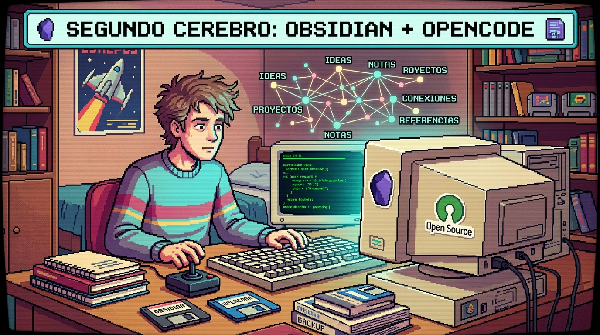
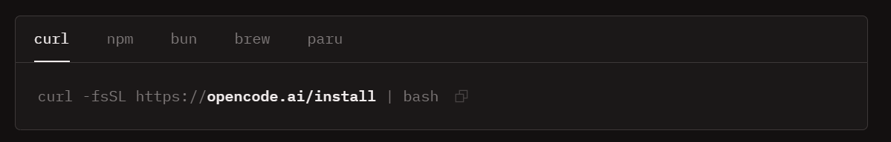
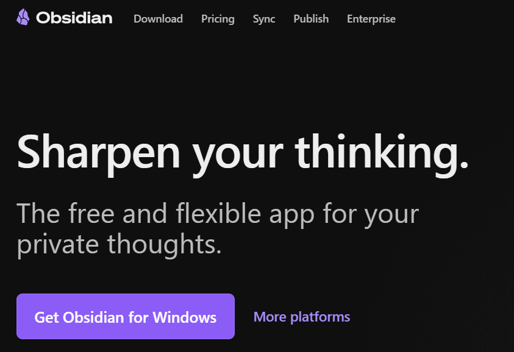

# 🧠 Segundo Cerebro — Obsidian + OpenCode



> [!IMPORTANT]
> Sistema de organización personal construido con herramientas 100% open source,
> diseñado para estudiantes que quieren dejar de perder apuntes y empezar
> a estudiar con inteligencia.

## ¿Qué es esto?

Un sistema de "segundo cerebro" que conecta **Obsidian** (tu base de conocimiento)
con **OpenCode** (un agente de IA local) para automatizar la organización de tus
apuntes, tareas, ideas y material de estudio — sin pagar suscripciones y sin que
tus datos salgan de tu computadora.

La idea central es simple:

- Tomas fotos de tus apuntes a mano
- Los conviertes a Markdown con una IA de internet y los organizas en su carpeta
- Cuando necesitas prepararte para un examen, le pides al agente
  que te genere resumen, flashcards o cronograma de estudio
- Todo corre local, en tu propia máquina

---

## ¿Por qué lo construí?

Como estudiante universitario me encontraba en el dilema de tomo mejores apuntes a mano que en
computadora o viceversa, pero esos apuntes se perdían o quedaban desorganizados.
Quería un sistema que:

1. No dependiera de suscripciones externas
2. Funcionara en una laptop sin GPU dedicada
3. Fuera lo suficientemente simple para que cualquiera pueda replicarlo
4. Le diera valor real a mis apuntes en vez de solo archivarlos

---

## Stack completo

> [!WARNING]
> ⚠️ Modelos Locales
> 
> Los modelos locales como  ***Qwen2.5-Coder 7B*** y  ***Gemma 4 E2B*** se demoran un poco en responder ya que ocupan los recursos de nuestra máquina, siendo así, es recomedable usar estos modelos en momentos que queramos que nuestra informacion se maneje de maner privada o no tengamos acceso a Internet.

| Herramienta                     | Rol                                          | Por qué esta                                        |
| ------------------------------- | -------------------------------------------- | ---------------------------------------------------- |
| **Obsidian**              | Base de conocimiento                         | Archivos .md locales, sin nube obligatoria           |
| **OpenCode**              | Agente que ejecuta las skills                | Open source, agnóstico de modelo                    |
| **Ollama**                | Corre los modelos localmente (sin internet)  | Gratis, fácil de usar en Windows/Mac/Linux          |
| **Qwen2.5-Coder 7B**      | Organiza archivos y ejecuta tareas (local)   | Especializado en código y manipulación de archivos |
| **Gemma 4 E2B**           | Conversación general y razonamiento (local) | El más liviano del stack, rápido en CPU            |
| **Plan Free de OpenCode** | Modelos de mayor calidad cuando hay internet | Sin costo, mejor rendimiento que los modelos locales |

> [!NOTE]
> Todo el stack corre en una laptop con i7-1355U, 16GB RAM
> y sin GPU dedicada. Si tienes eso o más, esto funciona en tu equipo.

---

## Estructura del vault

```
SegundoCerebro/
├── 01-Materias/              → subcarpetas por materia
├── 02-Personal/              → notas personales, reflexiones semanales
├── 03-To-Dos/                → tareas y pendientes
├── 04-Ideas/                 → ideas sueltas capturadas rápido
├── 05-Bandeja-Entrada/       → notas sin clasificar
├── _Attachments/             → imágenes y archivos en local
├── _Templates/               → plantillas de Templater
└── .opencode/skills/         → skills del agente (ver abajo)
```

---

## Skills locales incluidas

> [!TIP]
> 💡 Skills
> 
> Poner la carpeta de skills proporcionada dentro de la carpeta **.opencode**
>
> ```bash
> .opencode\skills\
> ```

Las skills son instrucciones reutilizables que le indican a OpenCode
cómo comportarse para tareas específicas. Se activan con lenguaje natural.

| Skill                  | Qué hace                                                           | Cómo activarla                                  |
| ---------------------- | ------------------------------------------------------------------- | ------------------------------------------------ |
| `preparacion-examen` | Genera resumen y preguntas de práctica desde tus apuntes           | "dame el resumen para prepararme para el examen" |
| `generar-flashcards` | Genera tarjetas de memoria compatibles con Spaced Repetition        | "genera las flashcards de estos apuntes"         |
| `glosario-materia`   | Extrae términos técnicos y genera`Glosario.md`                  | "genera el glosario de esta materia"             |
| `cronograma-examen`  | Plan de estudio día a día hasta la fecha del examen               | "tengo examen el [fecha], arma el cronograma"    |
| `exportar-notas`     | Une todas las notas de una materia en un solo archivo               | "exporta los apuntes de esta materia"            |
| `resumen-sesion`     | Guarda el contexto de una sesión antes de que se agoten los tokens | "guarda el resumen de esta sesión"              |
| `revision-bandeja`   | Clasifica archivos sin organizar en 05-Bandeja-Entrada/             | "revisa la bandeja de entrada"                   |
| `reporte-semanal`    | Balance semanal de notas, tareas y materias activas                 | "dame el reporte semanal"                        |
| `revisar-todos`      | Resumen priorizado de tareas pendientes                             | "qué tengo pendiente"                           |
| `cerrar-semana`      | Reflexión guiada de cierre de semana                               | "vamos a cerrar la semana"                       |

---

## Requisitos

### Hardware mínimo

- CPU: cualquier procesador moderno de 4+ núcleos (probado en i7-1355U)
- RAM: mínimo 8GB (recomendado 16GB para correr dos modelos sin problemas)
- Almacenamiento: ~15GB libres para los modelos
- GPU dedicada: **no necesaria**

### Software

- 
- 
- 
-  (Opcional)

---

## Instalación paso a paso

### 1. Descarga Warp - Terminal (no es obligatorio)

La instalación de Warp -  Terminal es para un ecosistema más intuitivo.

https://www.warp.dev/download

En caso de no instalar Warp, simplemente abrimos un **cmd** y nos ubicamos en el path de **Escritorio** o **Desktop**

### 2. Descarga Ollama TUI y GUI(esta es opcional)

https://ollama.com/download

#### 2.1 Descarga los modelos con Ollama

```bash
ollama pull qwen2.5-coder:7b
ollama pull gemma4:e2b
```

### 3. Descarga opencode TUI

https://opencode.ai/es



### 4. Descarga Obsidian

https://obsidian.md/


### 5. Clona el repositorio

Lo ideal es ubicarse en el `Escritorio` y abrir en **PowerShell** para clonar el repositorio ahí, esto con el fin de mantener un orden.

```bash
git clone https://github.com/Daxin7/Segundo-Cerebro.git
```

### 6. Abre la carpeta como vault en Obsidian

- Abre Obsidian → "Open folder as vault"
- Selecciona la carpeta `SegundoCerebro/`

### 7. Instala los plugins en Obsidian

Ajustes → Plugins de la comunidad → Buscar e instalar:

**Esenciales (ya incluidos en este repo):**

- Templater
- Tasks
- Spaced Repetition
- Pandoc Plugin

**Recomendados adicionales:**

- Excalidraw (diagramas y esquemas dentro del vault)
- Iconize (iconos en carpetas y archivos)
- Remotely Save (sincronización con Drive, OneDrive, Dropbox, etc.)

#### Configura Templater

- Ajustes → Templater → carpeta de plantillas: `_Templates`
- Aqui puedes añadir más templates pero he agregado una plantilla para apuntes en general(no depende de la materia)

#### Configura Remotely Save(Opcional)

- Ajustes → Remotely Save → elige tu servicio (Google Drive, OneDrive, etc.)
- Esto sincroniza tu vault automáticamente — incluyendo las fotos
  que lleguen desde tu celular

[Como conectar Google Drive a obsdian](https://youtu.be/_iJp6r57S_s)

### 8. Archivo necesario para conectar los modelos locales a opencode

En el path `.config\opencode\opencode.json`

```json
{
  "$schema": "https://opencode.ai/config.json",
  "plugin": [
    "@warp-dot-dev/opencode-warp"
  ],
  "provider": {
    "ollama": {
      "name": "Ollama Local",
      "options": {
        "baseURL": "http://localhost:11434/v1",
        "apiKey": "ollama"
      },
      "models": {
        "gemma4:e2b": {
          "name": "gemma4:e2b"
        },
        "qwen2.5-coder:7b": {
          "name": "qwen2.5-coder:7b"
        }
      }
    }
  },
  "agent": {
    "chat": {
      "description": "Modo conversación directa sin herramientas ni contexto pesado",
      "prompt": "Eres un asistente atento y conciso. 
      Responde directamente a las preguntas del usuario en español 
      de forma clara, sin ejecutar comandos ni analizar reglas de agente."
    }
  }
}
```

### 9. Plantilla Template general para apuntes
```bash
<%*
const materia = await tp.system.prompt("¿De qué materia son los apuntes?");
const tema = await tp.system.prompt("¿Cuál es el tema o título de esta nota?");
const semana = await tp.system.prompt("¿A qué semana o unidad corresponde? (ej: Semana-01)");
const fecha = tp.date.now("YYYY-MM-DD");

const carpeta = `01-Materias/${materia}/${semana}`;
const nombreArchivo = `${fecha}-${tema.replace(/ /g, "-")}`;

await tp.file.move(`${carpeta}/${nombreArchivo}`);
-%>
---
materia: <% materia %>
tema: <% tema %>
semana: <% semana %>
fecha: <% fecha %>
estado: borrador
---

# <% tema %>
**Materia:** <% materia %>
**Fecha:** <% fecha %>

---

## Apuntes

(escribe aquí)

---

## Conceptos clave

-

---

## Dudas
```

---

## Flujo de trabajo típico

> [!TIP]
> 💡
> 
> 1. Tomas apuntes a mano en clase
> 2. Esa foto la conviertes a md con una IA de Internet.
> 3. Colocas el archivo md generado en la carpeta de la materia que corresponda de los archivos.
> 4. Abres OpenCode en la raíz del vault
> 5. En modo chat ya sea con modelos locales o modelos del plan Free de OpenCode, empiezas a chatear con tus apuntes.

## Generar conexiones entre apuntes

Para poder generar conexiones tus apuntes, con el modo Build de open code le puedes dar los siguientes Prompts modelo.

> [!TIP]
> 💡 Prompt para generar conexiones entre todo el vault
> 
> ```bash
> Analiza todos los archivos .md de @01-Materias/
> y genera conexiones entre notas de todas las materias usando [[links]] de Obsidian.
>
> Prioriza conexiones entre materias distintas — por ejemplo si Estadística
> y Probabilidad comparten conceptos, conéctalos.
>
> Reglas:
> - Solo agrega [[links]], no modifiques contenido original
> - Primera aparición de cada concepto por nota
> - Lista conceptos sin nota propia bajo ## Conceptos sin nota
> - Confírmame el resumen de links generados por materia
> ```

> [!TIP]
> 💡 Prompt para generar conexiones en una materia o carpeta
> 
> ```bash
> Analiza todos los archivos .md de @01-Materias/[materia]/
> y genera conexiones entre notas relacionadas usando [[links]] de Obsidian.
>
> Reglas:
> - Si una nota menciona un concepto que está definido en otra nota, 
>  agrega [[nombre-de-la-nota]] en el lugar donde aparece ese concepto
> - No modifiques el contenido original de las notas, solo agrega los [[links]]
> - Si un concepto aparece varias veces en la misma nota, 
>  solo linkea la primera aparición
> - Si detectas conceptos relacionados que no tienen nota propia todavía,
>  listalos al final de cada nota bajo una sección ## Conceptos sin nota
> - Confírmame cuántos links generaste y en qué archivos
> ```

---

## Prompts Modelo para usar las skills

> [!TIP]
> 💡 Prompt para preparacion-examen
> 
> ```bash
> Basándote en @01-Materias/[materia]/[semana]/
> prepárame para el examen:
> - Dame un resumen de todos los temas cubiertos
> - Luego hazme un cuestionario.md de preguntas de práctica tipo examen, este documento lo debes en la misma carpeta.
>   esperando mi respuesta antes de pasar a la siguiente
> ```

> [!TIP]
> 💡 Prompt para generar-flashcards
> 
> ```bash
> Basándote en @01-Materias/[materia]/[semana]/[archivo].md
> genera las flashcards de estos apuntes en formato compatible
> con Spaced Repetition (este es un plugin de Obsidian) y guárdalas como Flashcards.md
> en la misma carpeta
> ```

> [!TIP]
> 💡 Prompt para glosario-materia
> 
> ```bash
> Basándote en todos los archivos de @01-Materias/[materia]/
> extrae todos los términos técnicos y definiciones,
> ordénalos alfabéticamente y guárdalos como Glosario.md
> dentro de la carpeta de esa materia.
> Si ya existe un Glosario.md, actualízalo sin borrar lo anterior
> ```

> [!TIP]
> 💡 Prompt para cronograma-examen
> 
> ```bash
> Tengo examen de [materia] el [fecha].
> Basándote en @01-Materias/[materia]/
> arma un cronograma de estudio día a día desde hoy hasta esa fecha,
> distribuyendo los temas según su complejidad.
> Deja el último día solo para repaso general.
> Guárdalo como Cronograma-Examen-[fecha].md en la carpeta de la materia
> ```

> [!TIP]
> 💡 Prompt para resumen-sesion
> 
> ```bash
> Genera un resumen de esta conversación en formato Markdown
> con las secciones: Contexto, Lo que hicimos, Pendiente
> y Archivos tocados.
> Guárdalo en la carpeta que corresponda según el tema tratado.
> Dale un titulo al archivo y añade su fecha, por ejemplo: POO-en-Python-15/08/2026.md
> ```

> [!TIP]
> 💡 Prompt para revision-bandeja
> 
> ```bash
> Lee todos los archivos en @05-Bandeja-Entrada/
> y clasifícalos en su carpeta correcta.
> Para cada archivo:
> - Si la materia es clara, muévelo directamente
> - Si es ambiguo, muéstrame tu sugerencia y espera mi confirmación
> Confírmame cada movimiento con ruta origen y destino
> ```

> [!TIP]
> 💡 Prompt para reporte-semanal
> 
> ```bash
> Genera el reporte de esta semana revisando todo el vault:
> - Notas creadas esta semana por carpeta
> - Tareas completadas y pendientes en @03-To-Dos/
> - Materias con actividad esta semana
> - Archivos con #revision-pendiente
> - Sugerencia de en qué enfocarse la próxima semana
> Guarda el reporte como Reporte-[fecha de hoy].md en @02-Personal/
> ```

> [!TIP]
> 💡 Prompt para revisar-todos
> 
> ```bash
> Lee todos los archivos de @03-To-Dos/
> y muéstrame un resumen priorizado de mis tareas:
> - Vencidas
> - Por hacer
> - Realizadas
> Omite las tareas ya completadas
> ```

> [!TIP]
> 💡 Prompt para cerrar-semana
> 
> ```bash
> Vamos a cerrar la semana.
> Revisa el vault para saber qué hice esta semana,
> luego hazme estas 3 preguntas una por una
> esperando mi respuesta antes de pasar a la siguiente:
> 1. ¿Qué salió bien esta semana?
> 2. ¿Qué no salió bien o podrías mejorar?
> 3. ¿Qué aprendiste esta semana, dentro o fuera de clases?
> Al final genera la nota de cierre con fecha de hoy y guárdala en @02-Personal/
> ```

> [!TIP]
> 💡 Prompt para exportar-notas
> 
> ```bash
> Une todos los archivos .md de @01-Materias/[materia]/
> en un solo documento limpio ordenado cronológicamente.
> Guárdalo como Apuntes-Completos-[materia]-[fecha].md
> en la misma carpeta de la materia
> ```

> [!TIP]
> 💡 Prompt para modo-estudio (Modo tutor - una sola nota)
> 
> ```bash
> Actúa como mi tutor de @01-Materias/[materia]/[semana]/[archivo].md
>
> Modo tutor:
> - Guíame con preguntas, no me des la respuesta directa de inmediato
> - Antes de avanzar de tema, verifica que entendí
> - Usa ejemplos prácticos relacionados a [Especificar carrera universitaria]
> - Si notas que algo no está claro en mis apuntes, dímelo
>
> Empieza presentándome un resumen de los temas que vas a cubrir
> y luego hazme la primera pregunta
> ```

> [!TIP]
> 💡 Prompt para modo-estudio (Modo tutor - semana completa)
> 
> ```bash
> Actúa como mi tutor de toda la carpeta @01-Materias/[materia]/[semana]/
>
> Modo tutor:
> - Guíame con preguntas, no me des la respuesta directa de inmediato
> - Antes de avanzar de tema, verifica que entendí
> - Usa ejemplos prácticos relacionados a [Especificar carrera universitaria]
>
> Empieza con un resumen de todos los temas de la semana
> y luego hazme la primera pregunta
> ```

---

## Plugins de Obsidian

### Esenciales

| Plugin            | ¿Para qué?                               |
| ----------------- | ------------------------------------------ |
| Templater         | Plantillas dinámicas                      |
| Tasks             | Gestión de tareas con fechas              |
| Spaced Repetition | Repasar flashcards generadas por el agente |
| Kanban            | Vista de tablero para tus to-dos           |

---

## Limitaciones conocidas

- La velocidad de respuesta del agente con modelo local depende de tu hardware en CPU sin GPU dedicada, espera entre $> 1 minuto$ por respuesta
- El reconocimiento de letra muy cursiva o poco clara puede fallar —
  letra de imprenta funciona mejor

---

## Contribuciones

Si replicas este proyecto y mejoras alguna skill, corriges un bug,
o agregas una que no está — los PRs son bienvenidos.

---
